# Análise e Modelagem dos Microdados do ENEM 2022

# 1. Descrição e objetivos
- Este é um projeto de ciência de dados de ponta a ponta (da coleta de dados até o deploy) em que é realizada a limpeza, análise exploratória e modelagem dos microdados do enem 2022 (dados públicos reais).
- A limpeza foi fundamental, dado que o conjunto original dos microdados tem mais de 2 GB de tamanho, tornando a manipulação, análise e modelagem dos dados inviável.
- A análise e modelagem se dividem em duas abordagens:
    - Análise e modelagem de desempenho: O objetivo dessa análise consiste em identificar as principais variáveis que impactam a nota do candidato, como elas se relacionam com o desempenho dele e como elas podem ser utilizadas para a predição dessa nota.
    - Análise e modelagem de abstenção: O objetivo dessa análise consiste em identificar os principais fatores que influenciam a ausência do candidato na prova. Além disso, observar como esses fatores se relacionam com a ausência e como eles podem ser utilizados para a predição da probabilidade de abstenção do estudante.
- Tais análises podem servir para interesses educacionais. O governo poderia utilizá-las para, por exemplo:
    - A partir do conhecimento dos fatores que mais influenciam a abstenção do candidato e das probabilidades de ausência preditas, determinar intervenções preventivas, aprimoramento da comunicação e planejamento estratégico de forma a mitigar essa alta taxa de abstenção em pontos de foco e, consequentemente, melhorar a qualidade do exame e da educação do país.
    - A partir do conhecimento dos fatores que mais impactam a nota do candidato e dos valores preditos para ela, identificar talentos potenciais (perfis de alunos que tendem a performar excepcionalmente no enem) e necessidades individuais (perfis de alunos que tendem a performar mal no enem), avaliar o desempenho educacional e realizar um planejamento estratégico para assistir àqueles menos capacitados. Consequentemente, isso melhoraria a qualidade do exame e da educação do país.
- Finalmente, foram desenvolvidas duas APIs Flask para deploy do modelo de ambas as análises supracitadas. Dessa forma, é possível prever a nota ou a probabilidade de abstenção de um candidato fornecendo dados socioeconômicos e educacionais sobre ele.
- Cada análise e modelagem realizada é abordada com mais detalhes nos próximos tópicos.

# 2. Limpeza de dados
- A limpeza foi fundamental, dado que o conjunto original dos microdados tem mais de 2 GB de tamanho, tornando a manipulação, análise e modelagem dos dados inviável. Nessa etapa, foram realizadas as seguintes tarefas:
    - Identificação e tratamento de valores nulos e duplicados, de acordo com os objetivos da análise.
    - Remoção de variáveis irrelevantes para a análise.
    - Feature engineering: Criação e alteração de variáveis existentes. Fusão, remoção e renomeação de categorias com base na melhor formatação para os objetivos propostos. Além disso, conversão colunas para o tipo de dado correto.
    - Otimização de memória: Conversão de variáveis a tipos de dados menores, a fim de melhorar a performance, possibilitando a leitura e manipulação dos dados em menor tempo, sem que haja a perda de informação. Colunas 'object' foram convertidas a 'category', colunas 'float64' foram convertidas a 'float32' e colunas 'int64' foram convertidas a 'int8'.
    - Tudo foi salvo em um arquivo parquet, de forma a agilizar a leitura e manter os tipos convertidos do tópico acima.
- Como resultado da limpeza, foi possível reduzir o tamanho do dataset de +2 GB para +221.7 MB, quase 10%!

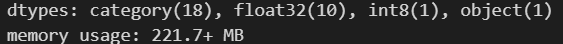

# 3. Análise de desempenho
- O objetivo dessa análise consiste em identificar as principais variáveis que impactam a nota do candidato, como elas se relacionam com o desempenho dele e como podem ser utilizadas para a predição dessa nota.
- Uma observação importante é que, dado que alunos ausentes ficam com nota nula, a amostra selecionada para essa análise consiste apenas de candidatos que compareceram em ambos os dias do enem. Introduzir ausentes incluiria assimetrias e distorções no estudo em questão.
- Perguntas respondidas na Análise de Desempenho:
    - Quem apresenta melhor desempenho, pessoas do sexo masculino ou feminino?
    - Existem diferenças no desempenho para pessoas de diferentes faixas etárias?
    - Em média, quais os estados com as maiores e as menores notas?
    - Como a renda influencia o desempenho do candidato?
    - Como a escolaridade do pai e da mãe influenciam o desempenho do candidato?
    - De que forma a falta de acesso a internet e/ou computador em casa impactam o desempenho do candidato?

# 3.1 Principais insights - Análise de desempenho
- A nota média geral no enem de 2022 é aproximadamente 543. 
- A nota média máxima no ENEM de 2022 é aproximadamente 856.
- Ciências da natureza é a área do conhecimento com o pior desempenho. A nota média é aproximadamente 496. Além disso, analisando os percentis, metade dos candidatos obtém uma nota de até 486 nessa prova. Esse resultado é bem baixo, principalmente se comparado com a área do conhecimento com o melhor desempenho, matemática. A nota média nela é aproximadamente 543. Uma observação importante é que esse indicador em matemática pode enganar. Apesar de ter a maior nota média, isso se deve ao modelo do enem, que naturalmente atribui mais pontos para essa prova.

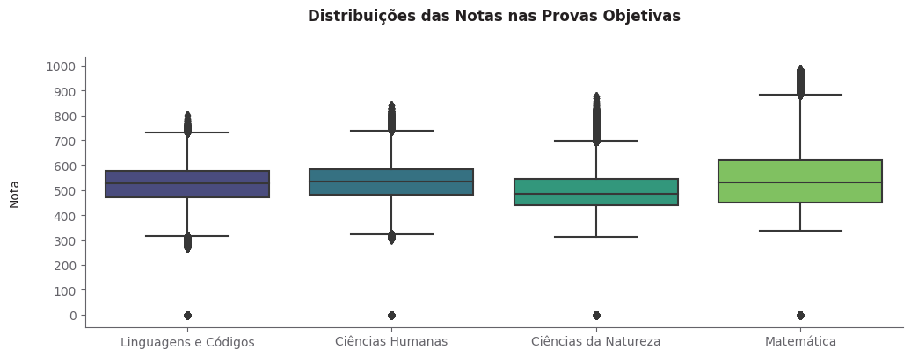

- Surpreendentemente, 42.16% dos candidatos não possuem computador em casa. Esse dado nos revela uma dificuldade e disparidade de condições dos estudantes, já que um computador com acesso a internet é a melhor ferramenta para estudos atualmente.
- 91.96% dos candidatos possuem acesso a internet em casa. Embora seja um baixo percentual, ainda é alarmante o fato de que aproximadamente 8% dos estudantes não possuem sequer internet para se preparar. Considerando um exame desse porte, isso representa um grande número de pessoas.

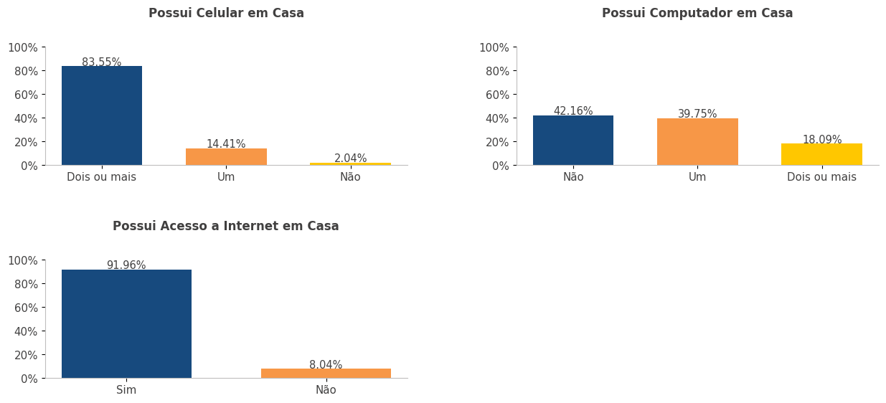

- Candidatos com um ou mais computadores em casa tendem a obter uma nota geral maior que aqueles que não possuem o dispositivo.
- Candidatos com acesso a internet em casa tendem a obter uma nota geral maior que aqueles que não possuem o recurso.

- Claramente, quanto maior a escolaridade do pai ou da mãe, melhor o desempenho do candidato.

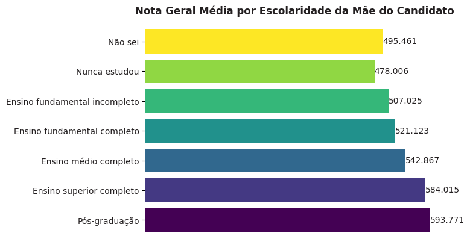

- É possível perceber que, em média, quanto maior a renda familiar mensal, maior a nota geral do candidato. Candidatos com renda acima de R$ 24.240,00 obtiveram uma nota geral média 1.33 vezes maior que candidatos com nenhuma renda, totalizando uma diferença absoluta de aproximadamente 157 pontos.

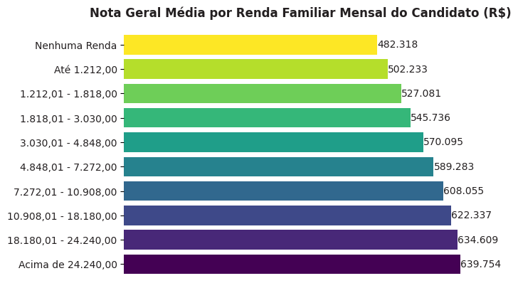

# 4. Análise de abstenção
- O objetivo dessa análise consiste em identificar os principais fatores que influenciam a ausência do candidato na prova. Além disso, observar como esses fatores se relacionam com a ausência e como podem ser utilizados para a predição da probabilidade de abstenção do estudante.
- Para essa análise, foi utilizado todo o conjunto de dados. Dessa forma, incluimos não só os estudantes que compareceram, mas também aqueles que faltaram ao exame, os quais são o nosso alvo.
- Principais perguntas respondidas na Análise de Abstenção:
    - A falta de acesso a internet e/ou computador em casa influenciam a abstenção do candidato na prova?
    - A escolaridade do pai e da mãe influenciam a abstenção do candidato na prova?
    - A renda familiar mensal influencia a abstenção do candidato na prova?
    - Existe alguma diferença na taxa de abstenção entre as diferentes faixas etárias?
    - Existe alguma diferença na taxa de abstenção entre pessoas do sexo masculino e do sexo feminino?
    - Quais regiões apresentam as maiores e as menores taxas de abstenção?

# 4.1 Principais insights - Análise de abstenção
- Ambos os dias de prova apresentam altas taxas de abstenção. Para o primeiro dia (provas de linguagens e ciências humanas) temos uma taxa de aproximadamente 28%, contra 32% para o segundo dia (ciências da natureza e matemática). Isso é preocupante, principalmente porque a enorme maioria dessas ausências não se devem a razões randômicas, mas sim por falta de preparo/confiança do candidato para realizar a prova. O governo deve trabalhar para mitigar essa problemática.

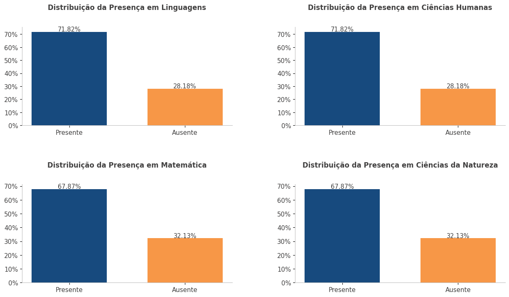

- A escolaridade do pai e/ou da mãe influenciam o comparecimento do candidato na prova. Claramente, à medida que o nível de escolaridade aumenta, a taxa de abstenção cai. Por exemplo, analisando a escolaridade da mãe, é possível perceber que a taxa de abstenção entre candidatos cujas mães nunca estudaram é o dobro da taxa para aqueles cujas mães possuem pós graduação.

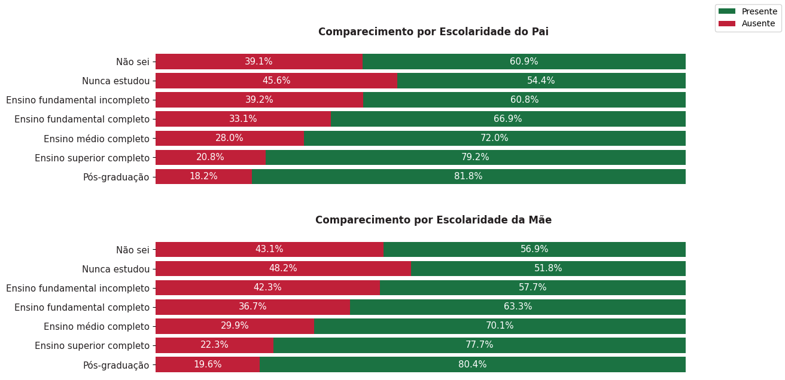

- A renda familiar mensal influencia o comparecimento do candidato na prova. Claramente, à medida que a renda aumenta, a taxa de abstenção cai. Por exemplo, a taxa de abstenção entre candidatos que não possuem nenhuma renda é mais que o dobro da taxa entre aqueles que possuem rendas maiores que 7 mil reais.

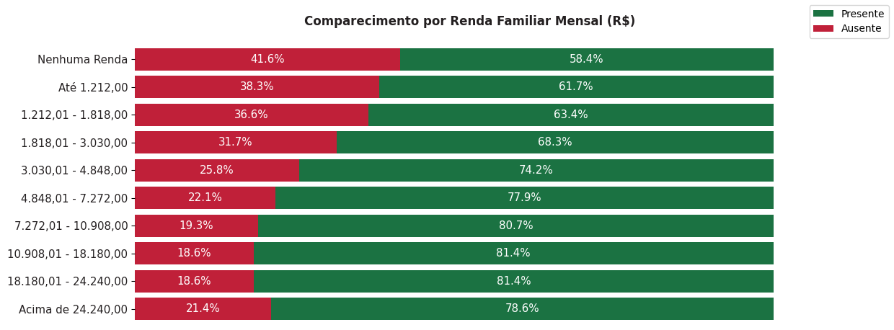

- Jovens tendem a ter uma taxa de abstenção menor que a de pessoas adultas a idosas.

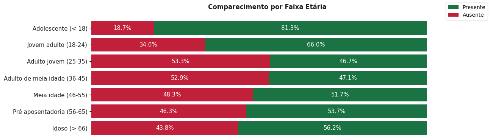

# 5. Modelagem de desempenho
- Para a predição da nota de um candidato (tarefa de regressão, aprendizado supervisionado com dados rotulados), foi utilizado um modelo de Regressão Lasso, dado o seu rápido treinamento e predição, alta interpretabilidade através dos coeficientes, regularização utilizando a penalidade l1 e seleção automática de variáveis, reduzindo os pesos de características irrelevantes a zero, gerando um modelo esparso.
- Foram consideradas diversas variáveis na construção do modelo. Os insights obtidos na etapa de análise exploratória de dados serviram de guia para tarefas de limpeza e pré-processamento de dados, necessárias para a aplicação de algoritmos de machine learning. 
- Para a limpeza de dados, criei o target (média das notas nas 5 provas), removi variáveis irrelevantes e variáveis que levariam a data leakage (notas e presenças), fundi categorias com base na nota geral média e nas proporções dentro da respectiva coluna, criei variáveis que indicavam qual a região do candidato, o nível de acesso tecnológico que ele tem em casa e a renda por pessoa, entre outras atividades.
- Para o pré-processamento, apliquei ordinal encoding em variáveis ordinais, como renda familiar mensal e faixa etária, a fim de manter essa característica, e one-hot encoding em variáveis nominais, como região, já que não possuíam alta cardinalidade e portanto não aumentariam a dimensionalidade de forma danosa. Após isso, foram escalonadas com standard scaling variáveis ordinais transformadas, uma vez que estamos utilizando um modelo linear, sensível ao feature scaling.
- Após o pré-processamento, avaliei através da validação cruzada k-fold modelos potenciais, a fim de selecionar um deles para a tunagem de hiperparâmetros e avaliação final no conjunto de testes, simulando o ambiente de produção. O modelo selecionado foi a Regressão Lasso, pelos motivos supracitados.
- O modelo escolhido foi tunado através da busca bayesiana, pois ela traz um balanço para o trade-off exploration-exploitation, realizando uma busca eficiente no espaço de hiperparâmetros.
- Finalmente, avaliando o modelo final no conjunto de testes (dados nunca antes vistos, simulando o ambiente de produção), o resultado obtido foi satisfatório, apesar de haver espaço para melhorias: 
    - Com um MAE de aproximadamente 57, as previsões do modelo são desviadas, em média, de 57 pontos em relação às notas reais dos candidatos no enem. 
    - Com um R2 de 0.31, aproximadamente 31% da variância do target é explicada pelo modelo / variáveis independentes.
    - Os erros nas amostras de treino, teste e validação são similares, indicando que o modelo não está com overfitting e generaliza de forma satisfatória para instâncias nunca antes vistas.

| Model   | MAE     | MAPE    | RMSE    | R2     |
|---------|---------|---------|---------|--------|
| Lasso   | 57.1358 | 11.1016 | 72.7676 | 0.3142 |

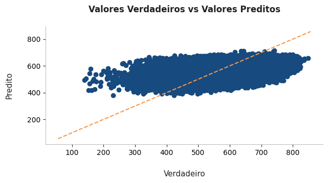

# 5.1 Interpretação dos coeficientes da Regressão Lasso
- Os coeficientes foram interpretados e, como eu suspeitava, algumas variáveis eram irrelevantes, ficando com coeficiente 0. Uma delas foi a variável sexo, o que fez total sentido pois durante a eda foi visto que a distribuição das notas era similar para ambos os sexos. Além disso, algumas das variáveis mais importantes foram:
    - lingua, status_conclusao_ensino_medio, renda_familiar_mensal, escola_publica, possui_computador_em_casa, escola_privada e escolaridade_mae.
    - Isso faz sentido, uma vez que vimos na eda que:
        - Alunos de escolas privadas apresentavam desempenho maior que os de escola pública.
        - Alunos que não possuíam computador em casa apresentavam desempenho menor que os que possuíam.
        - Quanto maior a renda familiar mensal e a escolaridade do responsável, maior a nota do candidato.
    - Todas, exceto escola_publica apresentam uma correlação positiva com a nota. A interpretação pode ser realizada da seguinte maneira:
        - O aumento de uma unidade em possui_computador_em_casa, ou seja, de nenhum para um, ou de um para dois ou mais, reflete um aumento de 9.45 na nota geral, considerando todas as outras variáveis constantes.
    - A variável escola_publica apresenta uma correlação negativa com a nota. Uma vez que esta representa uma variável dummy, indicando 1 caso o candidato seja aluno de escola pública, ou 0, caso não. A interpretação pode ser feita da seguinte forma:
        - Caso o estudante seja aluno de escola pública, a sua nota reduz em 10.2 pontos, considerando todas as outras variáveis constantes.

| Variável                        | Coeficiente  | Correlação  |
|---------------------------------|--------------|-------------|
| Intercepto                      | 531.943158   | Positiva    |
| lingua                          | 20.567666    | Positiva    |
| status_conclusao_ensino_medio   | 16.744819    | Positiva    |
| renda_familiar_mensal           | 16.114078    | Positiva    |
| escola_publica                  | -10.194798   | Negativa    |
| possui_computador_em_casa       | 9.445293     | Positiva    |
| escola_privada                  | 8.927823     | Positiva    |
| escolaridade_mae                | 8.176244     | Positiva    |

# 6. Modelagem de abstenção
- Para a predição da probabilidade de abstenção foi utilizado um modelo de Regressão Logística, dado o seu rápido treinamento e predição, alta interpretabilidade através da exponencial dos coeficientes (razão de chances), regularização utilizando a penalidade l1 e maior proximidade das probabilidades estimadas pelo modelo em relação às probabilidades reais calibradas.
- Foram consideradas diversas variáveis na construção do modelo. Os insights obtidos na etapa de análise exploratória de dados serviram de guia para tarefas de limpeza e pré-processamento de dados, necessárias para a aplicação de algoritmos de machine learning.
- A limpeza e pré-processamento de dados efetuados foram praticamente os mesmos que a modelagem de desempenho, exceto na etapa de feature engineering, em que o target criado indicava se o candidato esteve ausente em pelo menos um dos dias do enem e algumas categorias foram fundidas de forma diferente.
- Da mesma forma, a validação cruzada k-fold para seleção de modelos potenciais e a tunagem de hiperparâmetros com a busca bayesiana foram aplicadas. A Regressão Logística foi escolhida pelos motivos supracitados.
- Em suma, considerando que trata-se de uma classificação binária desbalanceada (temos aproximadamente 32% de ausentes contra 68% de presentes), as estratégias adotadas para lidar com esse problema foram:
    - Feature engineering para ajudar o modelo a discriminar entre abstenção (1) e presença (0).
    - Divisão ESTRATIFICADA em treino, teste e validação, para manter a proporção das classes positiva e negativa do target em todas as amostras, permitindo uma avaliação confiável.
    - Validação cruzada k-fold ESTRATIFICADA pelo mesmo motivo, a fim de selecionar o melhor modelo potencial para tunagem de hiperparâmetros com busca bayesiana.
    - Adoção do hiperparâmetro 'class_weight', aumentando o custo da log loss para erros de classificação de instâncias raras (positivas), resultando em uma maior atualização dos coeficientes e, consequentemente, aprendizado dos padrões dessa classe.
    - Escolha de métricas orientadas a uma avaliação de performance condizente com o desbalanceamento, como PR-AUC, ROC-AUC e Brier Score.
- Finalmente, avaliando o modelo final no conjunto de testes (dados nunca antes vistos, simulando o ambiente de produção), o resultado obtido foi satisfatório, apesar de haver espaço para melhorias:
    - Obtivemos um ROC AUC de 0.68, indicando que o modelo possui um poder discriminante satisfatório entre as classes positiva e negativa.
    - Obtivemos um Recall 0.68, de modo que o modelo identifica corretamente 68% dos ausentes.
    - O modelo apresenta ordenação nos escores, com faixas de probabilidade mais altas contendo mais ausentes.
    - Os scores nas amostras de treino, teste e validação são similares, indicando que o modelo não está com overfitting e generaliza de forma satisfatória para instâncias nunca antes vistas.

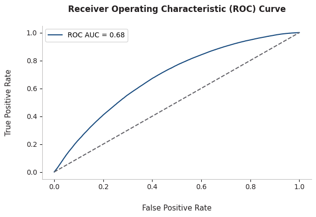

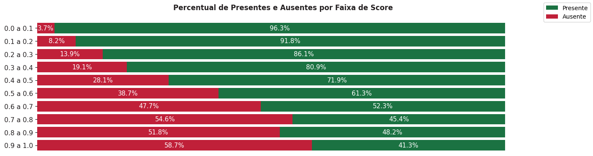

# 6.1 Interpretação dos coeficientes da Regressão Logística
- Os coeficientes foram interpretados e algumas das variáveis mais importantes foram: escola_privada, treineiro, nao_respondeu_escola, faixa_etaria, renda_familiar_mensal.
    - Isso faz sentido, uma vez que vimos na eda que:
        - A taxa de abstenção de alunos de escola pública era mais de quatro vezes maior que a de alunos de escola privada.
        - A taxa de abstenção entre candidatos adultos, de meia idade e idosos era maior que a de candidatos adolescentes e jovens adultos.
        - A taxa de abstenção entre candidatos de baixa renda era maior que a de candidatos de maior renda familiar mensal.
        - Treineiros tendem a ter uma menor taxa de abstenção.
    - Todas, exceto faixa_etaria e nao_respondeu_escola apresentam uma correlação negativa com o log-odds. A interpretação pode ser realizada da seguinte maneira:
        - Caso o candidato seja/tenha sido aluno de escola privada, as chances de abstenção diminuem em 65%, considerando as outras variáveis constantes.
        - Caso o candidato seja treineiro, as chances de abstenção diminuem em 55%, considerando as outras variáveis constantes.
        - Para cada aumento de uma unidade na renda familiar mensal (ou seja, de nenhuma renda para renda baixa, de renda média alta para renda alta, por exemplo), as chances de abstenção diminuem em 17%, considerando as outras variáveis constantes.
    - As variáveis faixa_etaria e nao_respondeu_escola apresentam uma correlação negativa com o log-odds. A interpretação pode ser feita da seguinte forma:
        - Caso o candidato não tenha respondido em que tipo de escola estuda/estudou, as chances de abstenção aumentam em 85%, considerando as outras variáveis constantes.
        - Para cada aumento de uma unidade na faixa_etaria (ou seja, de adolescente para jovem adulto, de adulto para meia idade a idoso, por exemplo), as chances de abstenção aumentam em 35%, considerando as outras variáveis constantes.

| Variável               | Coeficiente  | Correlação  | Exponencial  |
|------------------------|--------------|-------------|--------------|
| escola_privada         | -1.052792    | Negativa    | 0.348962     |
| treineiro              | -0.779011    | Negativa    | 0.458859     |
| nao_respondeu_escola   | 0.616755     | Positiva    | 1.852905     |
| nordeste               | -0.363087    | Negativa    | 0.695526     |
| faixa_etaria           | 0.297036     | Positiva    | 1.345864     |
| escola_publica         | 0.185337     | Positiva    | 1.203624     |
| renda_familiar_mensal  | -0.176665    | Negativa    | 0.838061     |

# 7. Deploy e próximos passos
- Após o desenvolvimento dos modelos, foi realizado o deploy de cada um seguindo princípios básicos de CI/CD e programação modular:
    - O desenvolvimento do estudo nos notebooks foi convertido em scripts .py para produção.
    - Esses scripts foram divididos em componentes de ingestão de dados, transformação de dados e treinamento de modelo, seguindo os mesmos passos do estudo.
    - Uma vez desenvolvidos os componentes, foram implementados pipelines de treinamento e predição automatizados que os utilizam. 
    - O pipeline de treinamento executa esses componentes e obtém todos os artefatos do modelo de machine learning (modelo .pkl, preprocessor .pkl, dados de treino, teste e validação e dados brutos), enquanto o pipeline de predição realiza as predições consumindo esses artefatos obtidos. 
    - Tudo isso foi implementado utilizando boas práticas como o uso de ambientes virtuais para isolamento de dependências, tratamento de exceções, logs, documentação, etc.
    - Finalmente, foram desenvolvidos duas APIs Flask integrando tudo que foi mencionado nos tópicos acima.
    - O meu objetivo com isso foi seguir ao máximo um workflow real de um projeto de ciência de dados, construindo meu projeto inteiro como um pacote reprodutível.
    - Entre os próximos passos, está o deploy em alguma cloud, como a aws.

# 8. Tecnologias utilizadas
As tecnologias e ferramentas utilizadas foram Python (Pandas, Numpy, Matplotlib, Seaborn, Scikit-Learn, Category-Encoders, Scikit-Optimize, Xgboost, Flask), Jupyter Notebook, Git e Github (controle de versão), algoritmos de regressão e classificação de aprendizado de máquina, estatística, Anaconda (terminal) e Visual Studio Code (ambiente de desenvolvimento do projeto).

# 9. Execute o projeto na sua máquina local

