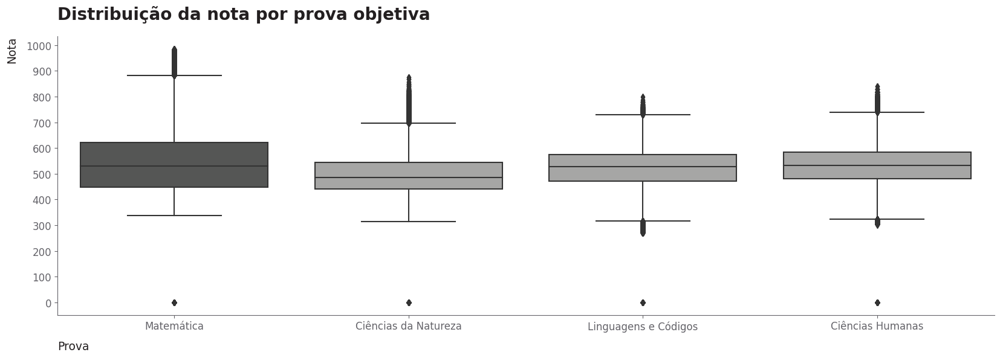

# Análise e Modelagem dos Microdados do ENEM 2022

# 1. Descrição e objetivos
- Este é um <b>projeto de ciência de dados de ponta a ponta (da coleta de dados até o deploy)</b> em que é realizada a <b>limpeza, análise exploratória e modelagem dos microdados do enem 2022 (dados públicos reais).</b>
- A <b>limpeza</b> foi fundamental, dado que o conjunto original dos microdados tem mais de 2 GB de tamanho, tornando a manipulação, análise e modelagem dos dados inviável.
- A <b>análise e modelagem</b> se dividem em duas <b>abordagens:</b>
    - <b>Análise e modelagem de desempenho:</b> O <b>objetivo</b> dessa análise consiste em identificar as principais variáveis que impactam a nota do candidato, como elas se relacionam com o desempenho dele e como elas podem ser utilizadas para a predição dessa nota.
    - <b>Análise e modelagem de abstenção:</b> O <b>objetivo</b> dessa análise consiste em identificar os principais fatores que influenciam a ausência do candidato na prova. Além disso, observar como esses fatores se relacionam com a ausência e como eles podem ser utilizados para a predição da probabilidade de abstenção do estudante.
- Tais análises podem servir para interesses educacionais. O governo poderia utilizá-las para, por exemplo:
    - A partir do conhecimento dos fatores que mais influenciam a abstenção do candidato e das probabilidades de ausência preditas, determinar intervenções preventivas, aprimoramento da comunicação e planejamento estratégico de forma a mitigar essa alta taxa de abstenção em pontos de foco e, consequentemente, melhorar a qualidade do exame e da educação do país.
    - A partir do conhecimento dos fatores que mais impactam a nota do candidato e dos valores preditos para ela, identificar talentos potenciais (perfis de alunos que tendem a performar excepcionalmente no enem) e necessidades individuais (perfis de alunos que tendem a performar mal no enem), avaliar o desempenho educacional e realizar um planejamento estratégico para assistir àqueles menos capacitados. Consequentemente, isso melhoraria a qualidade do exame e da educação do país.
- Finalmente, foram desenvolvidas duas <b>APIs Flask</b> para <b>deploy</b> do modelo de ambas as análises supracitadas. Dessa forma, é possível prever a nota ou a probabilidade de abstenção de um candidato fornecendo dados socioeconômicos e educacionais sobre ele.
- Cada análise e modelagem realizada é abordada com mais detalhes nos próximos tópicos.

# 2. Limpeza de dados
- A <b>limpeza</b> foi fundamental, dado que o conjunto original dos microdados tem mais de 2 GB de tamanho, tornando a manipulação, análise e modelagem dos dados inviável. Nessa etapa, foram realizadas as seguintes <b>tarefas:</b>
    - Identificação e tratamento de valores nulos e duplicados, de acordo com os objetivos da análise.
    - Remoção de variáveis irrelevantes para a análise.
    - Feature engineering: Criação e alteração de variáveis existentes. Fusão, remoção e renomeação de categorias com base na melhor formatação para os objetivos propostos. Além disso, conversão colunas para o tipo de dado correto.
    - Otimização de memória: Conversão de variáveis a tipos de dados menores, a fim de melhorar a performance, possibilitando a leitura e manipulação dos dados em menor tempo, sem que haja a perda de informação. Colunas 'object' foram convertidas a 'category', colunas 'float64' foram convertidas a 'float32' e colunas 'int64' foram convertidas a 'int8'.
    - Tudo foi salvo em um arquivo parquet, de forma a agilizar a leitura e manter os tipos convertidos do tópico acima.
- Como <b>resultado da limpeza</b>, foi possível reduzir o tamanho do dataset de +2 GB para +221.7 MB, quase 10%!

# 3. Análise de desempenho
- O <b>objetivo</b> dessa análise consiste em identificar as principais variáveis que impactam a nota do candidato, como elas se relacionam com o desempenho dele e como podem ser utilizadas para a predição dessa nota.
- Uma observação importante é que, dado que alunos ausentes ficam com nota nula, a amostra selecionada para essa análise consiste apenas de candidatos que compareceram em ambos os dias do enem. Introduzir ausentes incluiria assimetrias e distorções no estudo em questão.
- <b>Perguntas respondidas na Análise de Desempenho:</b>
    - Quem apresenta melhor desempenho, pessoas do sexo masculino ou feminino?
    - Existem diferenças no desempenho para pessoas de diferentes faixas etárias?
    - Em média, quais os estados com as maiores e as menores notas?
    - Como a renda influencia o desempenho do candidato?
    - Como a escolaridade do pai e da mãe influenciam o desempenho do candidato?
    - De que forma a falta de acesso a internet e/ou computador em casa impactam o desempenho do candidato?

# 3.1 Principais insights - Análise de desempenho
- A nota média geral no enem de 2022 é aproximadamente 543. 
- A nota média máxima no ENEM de 2022 é aproximadamente 856.
- Ciências da natureza é a área do conhecimento com o pior desempenho. A nota média é aproximadamente 496. Além disso, analisando os percentis, metade dos candidatos obtém uma nota de até 486 nessa prova. Esse resultado é bem baixo, principalmente se comparado com a área do conhecimento com o melhor desempenho, matemática. A nota média nela é aproximadamente 543. Uma observação importante é que esse indicador em matemática pode enganar. Apesar de ter a maior nota média, isso se deve ao modelo do enem, que naturalmente atribui mais pontos para essa prova.

- Surpreendentemente, 42.16% dos candidatos não possuem computador em casa. Esse dado nos revela uma dificuldade e disparidade de condições dos estudantes, já que um computador com acesso a internet é a melhor ferramenta para estudos atualmente.
- 91.96% dos candidatos possuem acesso a internet em casa. Embora seja um baixo percentual, ainda é alarmante o fato de que aproximadamente 8% dos estudantes não possuem sequer internet para se preparar. Considerando um exame desse porte, isso representa um grande número de pessoas.

- Candidatos com um ou mais computadores em casa tendem a obter uma nota geral maior que aqueles que não possuem o dispositivo.
- Candidatos com acesso a internet em casa tendem a obter uma nota geral maior que aqueles que não possuem o recurso.

- Claramente, quanto maior a escolaridade do pai ou da mãe, melhor o desempenho do candidato.

- É possível perceber que, em média, quanto maior a renda familiar mensal, maior a nota geral do candidato. Candidatos com renda acima de R$ 24.240,00 obtiveram uma nota geral média 1.33 vezes maior que candidatos com nenhuma renda, totalizando uma diferença absoluta de aproximadamente 157 pontos.

# 4. Análise de abstenção
- O <b>objetivo</b> dessa análise consiste em identificar os principais fatores que influenciam a ausência do candidato na prova. Além disso, observar como esses fatores se relacionam com a ausência e como podem ser utilizados para a predição da probabilidade de abstenção do estudante.
- <b>Principais perguntas respondidas na Análise de Abstenção:</b>
    - A falta de acesso a internet e/ou computador em casa influenciam a abstenção do candidato na prova?
    - A escolaridade do pai e da mãe influenciam a abstenção do candidato na prova?
    - A renda familiar mensal influencia a abstenção do candidato na prova?
    - Existe alguma diferença na taxa de abstenção entre as diferentes faixas etárias?
    - Existe alguma diferença na taxa de abstenção entre pessoas do sexo masculino e do sexo feminino?
    - Quais regiões apresentam as maiores e as menores taxas de abstenção?

# 4.1 Principais insights - Análise de abstenção
- Ambos os dias de prova apresentam altas taxas de abstenção. Para o primeiro dia (provas de linguagens e ciências humanas) temos uma taxa de aproximadamente 28%, contra 32% para o segundo dia (ciências da natureza e matemática). Isso é preocupante, principalmente porque a enorme maioria dessas ausências não se devem a razões randômicas, mas sim por falta de preparo/confiança do candidato para realizar a prova. O governo deve trabalhar para mitigar essa problemática.

- A escolaridade do pai e/ou da mãe influenciam o comparecimento do candidato na prova. Claramente, à medida que o nível de escolaridade aumenta, a taxa de abstenção cai. Por exemplo, analisando a escolaridade da mãe, é possível perceber que a taxa de abstenção entre candidatos cujas mães nunca estudaram é o dobro da taxa para aqueles cujas mães possuem pós graduação.

- A renda familiar mensal influencia o comparecimento do candidato na prova. Claramente, à medida que a renda aumenta, a taxa de abstenção cai. Por exemplo, a taxa de abstenção entre candidatos que não possuem nenhuma renda é mais que o dobro da taxa entre aqueles que possuem rendas maiores que 7 mil reais.

- Jovens tendem a ter uma taxa de abstenção menor que a de pessoas adultas a idosas.

# 5. Modelagem de desempenho

- 2. Limpeza de dados, 3. Análise de Abstenção, 4. Análise de desempenho, 5. Insights Abstenção, 6. Insights Desempenho, 7. Modelagem abstenção, 8. Resultados abstenção. 9. Modelagem desempenho. 10. Resultados desempenho. 11. Deploy e próximos passos. 12. Execute na sua máquina

- Para a <b>predição da nota<b> de um candidato (tarefa de regressão, aprendizado supervisionado com dados rotulados), foi utilizado um modelo de <b>Regressão Lasso</b>, dado o seu rápido treinamento e predição, alta interpretabilidade através dos coeficientes, regularização utilizando a penalidade l1 e seleção automática de variáveis irrelevantes, reduzindo os seus pesos a zero, gerando um modelo esparso.
- O <b>pipeline de modelagem</b> será detalhado mais adiante na documentação. Foram adotados os seguintes passos:
    1. Limpeza de dados (separação da amostra a ser utilizada, contendo apenas alunos presentes, os quais não possuem notas nulas, feature engineering, entre outras tarefas).
    2. Divisão dos dados em treino, teste e validação.
    3. Validação cruzada k-fold para comparação inicial de distintos modelos e seleção de modelos potenciais.
    4. Seleção de modelo de Regressão Lasso para tunagem de hiperparâmetros utilizando a busca bayesiana.
    5. Avaliação do modelo final tunado no conjunto de testes, simulando o ambiente de produção. Análise da distribuição dos resíduos e valores preditos vs valores reais, além de métricas como MAE e RMSE. Ademais, verificação dos scores nas diferentes amostras (treino, teste, validação e validação cruzada) para certificar-se de que não há overfit.
    6. Interpretação dos resultados/coeficientes do modelo para identificar quais fatores mais impactam o desempenho do candidato.
    7. Deploy.

- Para a <b>predição da probabilidade de abstenção</b> foi utilizado um modelo de <b>Regressão Logística<b>, dado o seu rápido treinamento e predição, alta interpretabilidade através da exponencial dos coeficientes (razão de chances), regularização utilizando a penalidade l1 e maior proximidade das probabilidades estimadas pelo modelo em relação às probabilidades reais calibradas.
- O <b>pipeline de modelagem</b> será detalhado mais adiante na documentação. Em se tratando de uma classificação binária desbalanceada, foram adotados os seguintes passos:
    1. Limpeza de dados (feature engineering, remoção de variáveis irrelevantes, fusão de categorias, entre outras tarefas).
    2. Divisão ESTRATIFICADA dos dados em treino, teste e validação para manter a proporção de cada classe do target em todas as amostras.
    3. Validação cruzada k-fold ESTRATIFICADA para comparação inicial de distintos modelos e seleção de modelos potenciais. A estratificação permite que mantenhamos o mesmo desbalanceamento em todas as amostras, garantindo uma avaliação de performance confiável.
    4. Seleção de modelo de Regressão Logística para tunagem de hiperparâmetros utilizando a busca bayesiana adotando o class_weight para permitir que o modelo aprenda bem padrões por trás da classe minoritária (candidatos ausentes).
    5. Avaliação do modelo final tunado no conjunto de testes, simulando o ambiente de produção. Utilização de métricas como o Brier Score, ROC AUC e PR AUC, que, por focar na classe positiva, fornece uma boa avaliação quando temos dados desbalanceados. Foi também analisada a distribuição das classes positiva e negativa entre os scores de probabilidades preditos. Finalmente, realizou-se a verificação dos scores nas diferentes amostras (treino, teste, validação e validação cruzada) para certificar-se de que não há overfit.
    6. Interpretação da exponencial dos coeficientes (razão de chances) para verificar quais as variáveis mais determinantes na abstenção do candidato.
    7. Deploy.

- Após o desenvolvimento dos modelos, foi realizado o <b>deploy</b> de cada um seguindo princípios básicos de CI/CD e programação modular:
    - O desenvolvimento do estudo nos notebooks foi convertido em scripts .py para produção.
    - Esses scripts foram divididos em componentes de ingestão de dados, transformação de dados e treinamento de modelo, seguindo os mesmos passos do estudo.
    - Uma vez desenvolvidos os componentes, foram implementados pipelines de treinamento e predição automatizados que os utilizam. 
    - O pipeline de treinamento executa esses componentes e obtém todos os artefatos do modelo de machine learning (modelo .pkl, preprocessor .pkl, dados de treino, teste e validação e dados brutos), enquanto o pipeline de predição realiza as predições consumindo esses artefatos obtidos. 
    - Tudo isso foi implementado utilizando boas práticas como o uso de ambientes virtuais para isolamento de dependências, tratamento de exceções, logs, documentação, etc.
    - Finalmente, foram desenvolvidos duas APIs Flask integrando tudo que foi mencionado nos tópicos acima.
    - O meu objetivo com isso foi seguir ao máximo um workflow real de um projeto de ciência de dados, construindo meu projeto inteiro como um pacote reprodutível.

